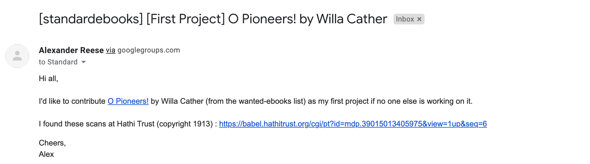
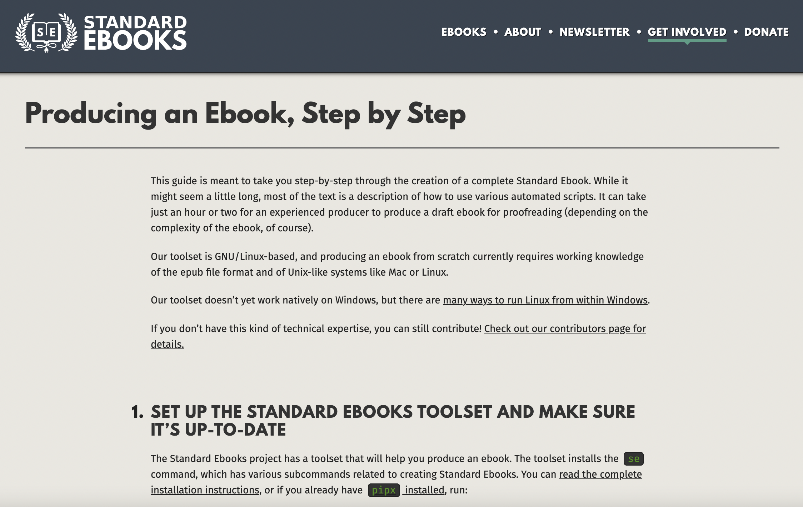
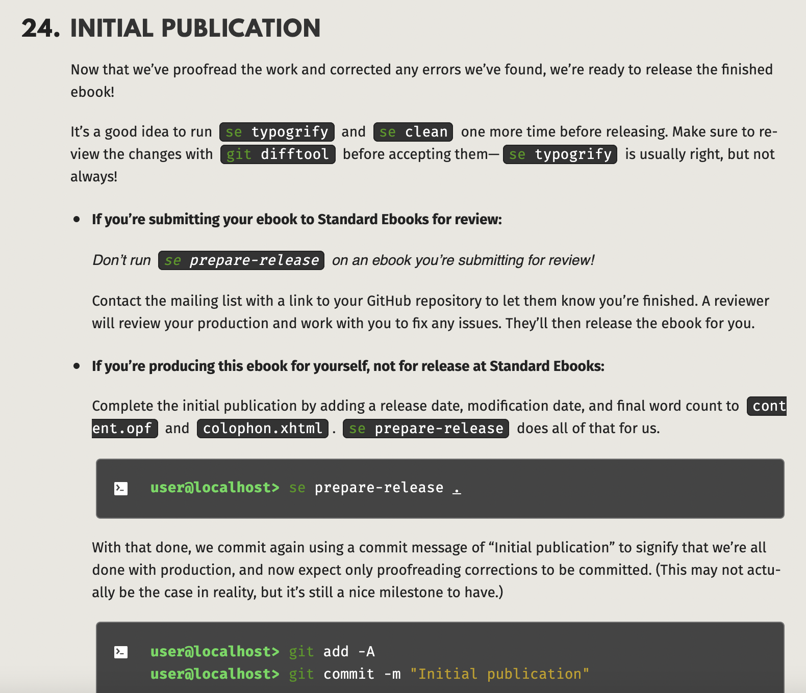
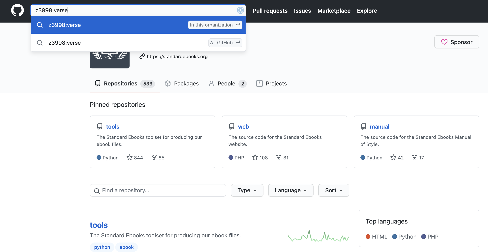
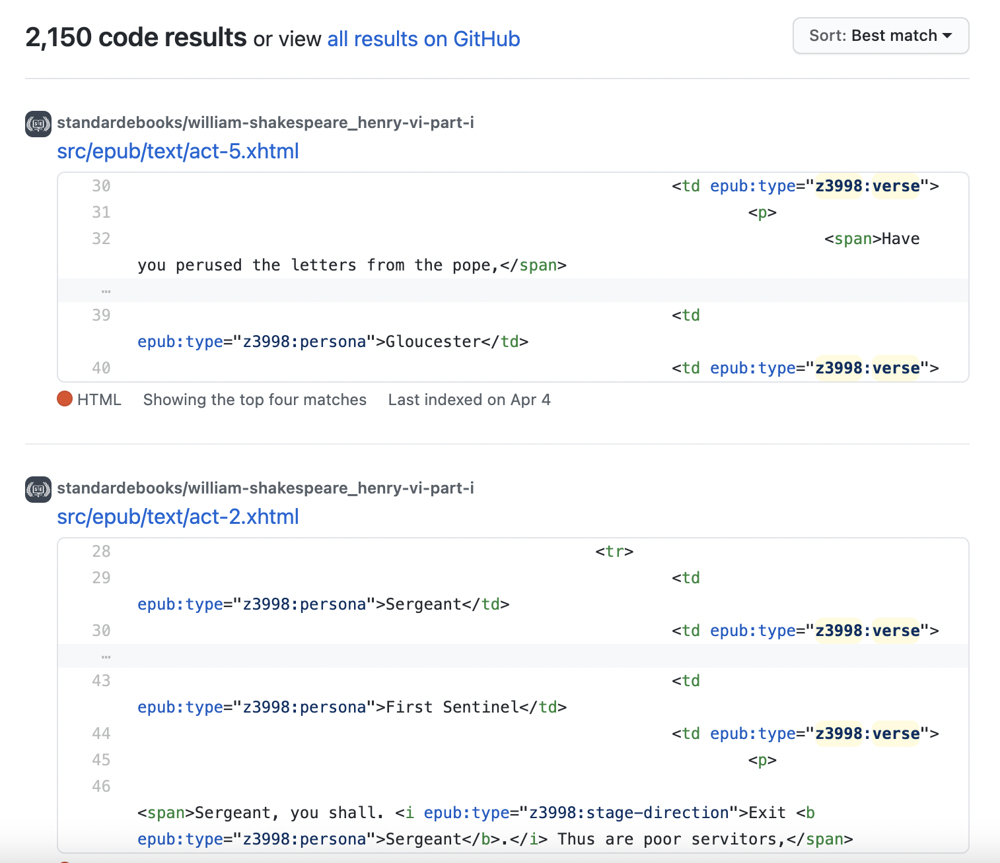
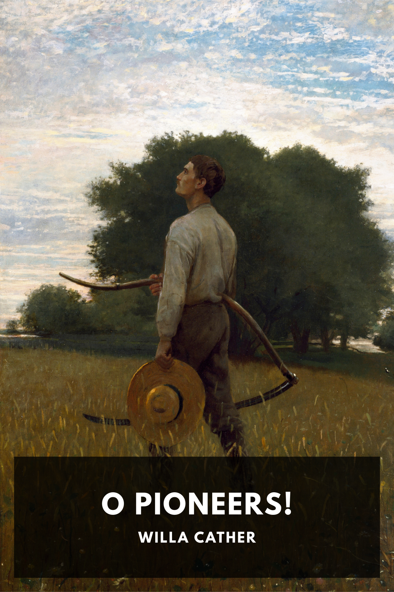
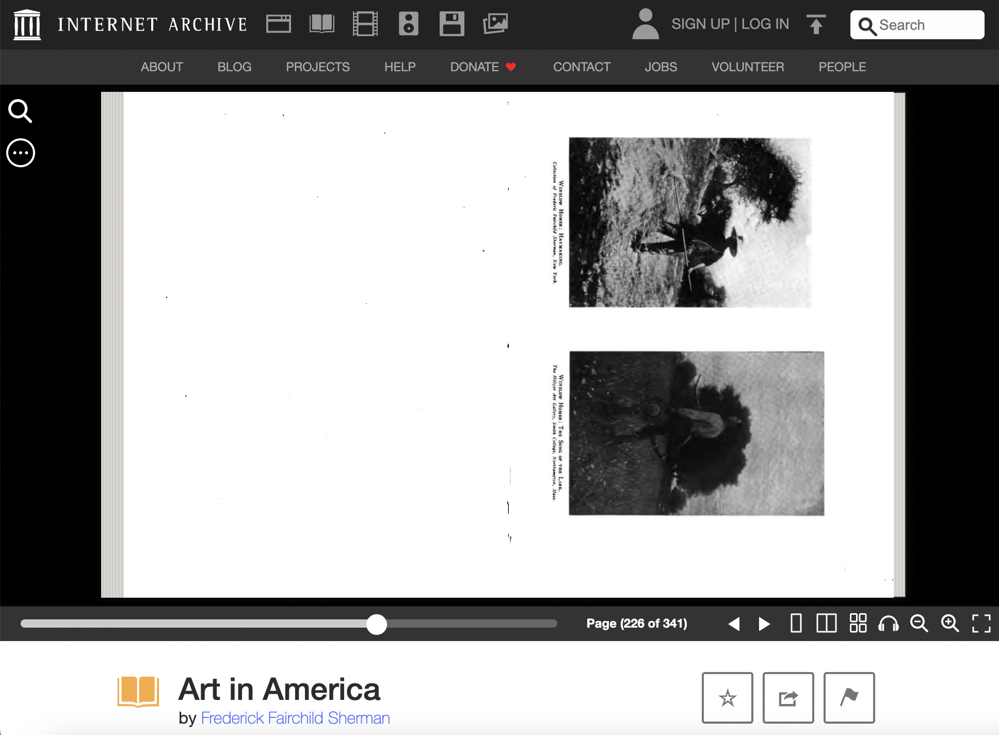

## The Standard Ebooks project

{width=75%}

## Proposing the project

- initiating contact, over-preparing
  - approved 

{width=100%}

## Getting to Work

- structuring an epub ebook directory, creating structural divisions, adjusting typography, modernizing spelling, semantic markup, creating metadata 

- Manual of Style

- new contributor's guide:

{width=57%} {width=42%}

## Resources & Communication

- learned to search inside github repos

{width=60%} {width=39%}

- **not** much contact/interaction with project leaders
- by trying to "Ask questions the smart way," I did my homework first and found my answers

## Proposing artwork

- required proposal and approval
- made a mistake, had to follow up wtih PD proof

{width=32%}  {width=65%}

- *embarassed*!

## Management and Task conception

- benevolent dictatorship
  - coordination or control?

- structured, pre-defined tasks
  - ebook production more like crowdsourcing than peer production? 
  
- credit and incentives

